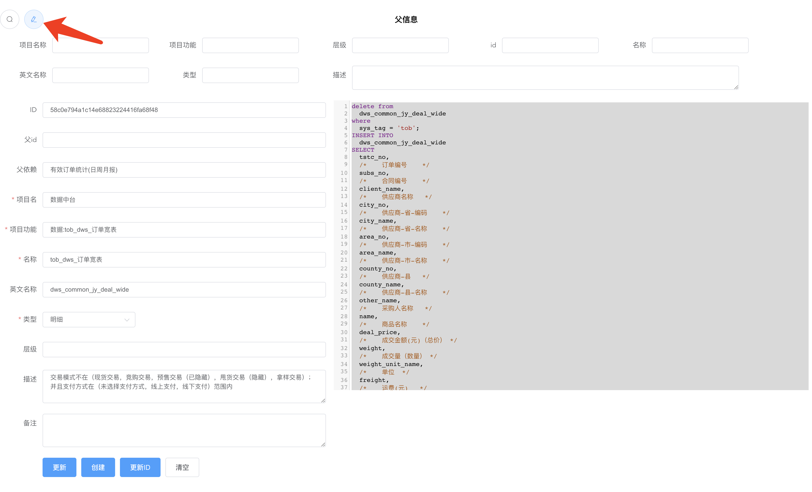

# ReadMe

## 简介

​		这是一个sql保存小工具，用于快速保存sql、快速查询sql使用。由于工作需要支持导出sql、报表操作。为此临时起意做一个工具脱离使用excel方式进行sql统计、保存。后续还有一些想法，需根据时间情况决定，目前该工具已经供自己使用。工具组成：springboot + vue ，代码简单。

## 项目结构

```
.
├── ReadMe.md
├── assets
│   ├── image-20210111164155279.png
│   ├── image-20210111164544640.png
│   ├── image-20210111165058565.png
│   ├── image-20210111165232075.png
│   ├── image-20210111165313192.png
│   └── image-20210111165523233.png
├── java
│   └── sql-tool
└── vue
    └── sql-app
```

- ReadMe.md 作为项目介绍信息记录文件，使用markdown编写

- assets：存储文档编写所需的静态资源文件

- java：用于存放java后台项目代码，

- vue：用于存放前端vue代码

  

## 使用

### 布局简介

页面功能分3个功能区：

- 1、搜索+剪切板

- 2、父信息查看区

- 3、信息保存区


#### 搜索

​     **点击搜索后会弹出查询信息**


#### 剪切板

剪切板用于临时放一些需要编辑、对比的信息



剪切板内放入信息，折叠后信息不回丢失，因为没有持久化，所以刷新后会丢失。


#### 编辑区

编辑区注意提供：更新、创建、更新ID、清空操作

- 更新：更新该ID记录的信息。
- 创建：创建一条新的记录并持久化到DB，相同ID无法创建，可通过 `更新ID` 操作随机生成新的ID值进行创建。
- 更新ID：前端页面随机生成UUID作为存储主键。
- 清空：清空除sql编辑区外的其他信息，同时刷新UUID，方便新数据录入。


## Java项目

整体项目十分简单，使用maven构建完成，按需打包即可运行，数据库采用postgresql(GreenPlum) ，如果个人需要可对接mysql

初始化脚本放在 `classpath:resource/sql` 下


## Vue项目

使用 `npm run serve` `npm run build`命令完成运行以及打包部署操作，代码简单，未进行过多封装。修改部署时注意修改: `main.js` 即可

`main.js`


`vue.config.js`


